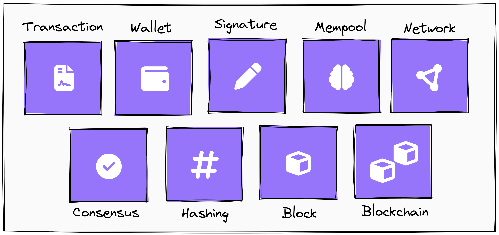

# 💻🔗 Blockchain Developer - Udacity 

This repository aims to showcase all the projects I developed during the Blockchain Developer Nanodegree on [Udacity's](udacity.com) platform. Throughout this program, I was able to explore many concepts and technologies related to the blockchain's world, such as smart contracts, public and private keys, signatures, distributed consensus, and more. In this way, the projects explored here in this program aim to practice and develop my skills in implementing and developing blockchain-based solutions, ranging from simple applications to more complex and scalable systems.

## ❔ What is Blockchain? 

Blockchain is a revolutionary technology that serves as a decentralized and distributed framework for securely storing data in a transparent and immutable way. It functions as a digital ledger of transactions that is shared among a network of computers, known as nodes. Each transaction is grouped into a block, and these blocks are chained together chronologically, creating a blockchain.

One of the most important features of blockchain technology is its immutability. Once a transaction is recorded in a block and added to the chain, it cannot be retroactively altered without the consensus of the majority of the network. This ensures high security and reliability for the data stored on the blockchain, making it ideal for a wide range of applications, from financial systems to supply chains and electronic voting.

There are many components involved in blockchain, among them, we can mention: transactions, wallets, signatures, the mempool, the blockchain network, the consensus protocol, hashing, blocks, and the blockchain itself. These projects aim to explore these concepts in many different ways, using state-of-the-art blockchain technologies.

## 📂 Projects

Below are the projects developed during the Blockchain Developer Nanodegree:

1️⃣ [ Create Your Own Private Blockchain](https://github.com/marianabritoazevedo/blockchain_udacity/project1)

2️⃣ [ Build CryptoStar Dapp on Ethereum]()

3️⃣ [ Ethereum Dapp for Tracking Items through Supply Chain]()

4️⃣ [ FlightSurety]()