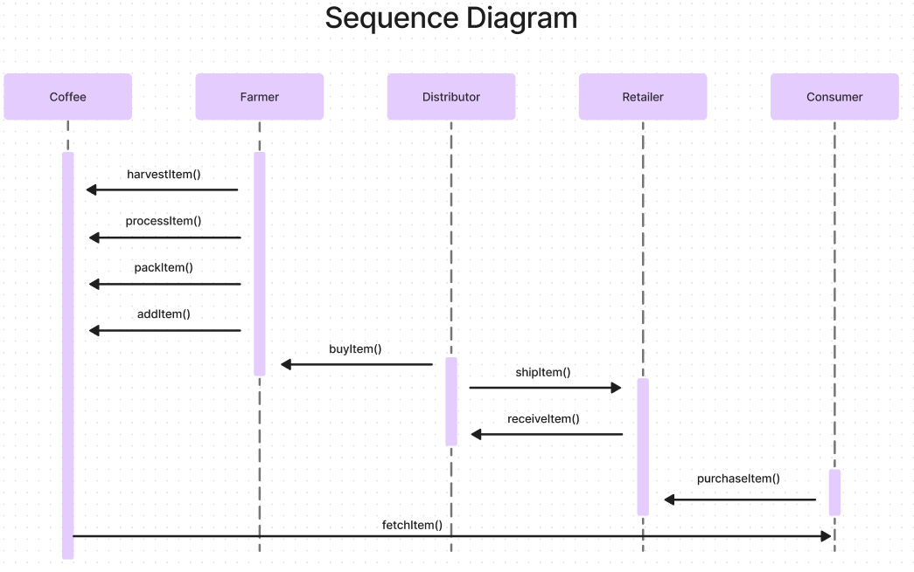

# 🔗☕ Ethereum Dapp for Tracking Items through Supply Chain

This project aims to create a supply chain for coffee beans creating smart contracts with solidity, making tests with Mocha and Chai, and finally, developping an Ethereum Dapp with Web3js.

## UML diagrams

### Activity Diagram

### Sequence Diagram

### State Diagram

### Class Diagram

## Libraries and Tools

- **Node: 20.11.0**

    Node.js enables JavaScript execution outside browsers, commonly used for server-side scripting and running decentralized applications (DApps) in Ethereum projects.

- **Truffle: v5.11.5** 

    Truffle simplifies Ethereum development with tools for smart contract compilation, deployment, testing, and asset management, enhancing productivity and code quality.

- **Web3js: v1.10.0**

    Web3.js facilitates interaction with smart contracts in ethereum, enabling DApp creation with APIs for transactions, contract deployment, data querying, and event subscription.

- **Solidity: v0.5.16 (but using compiler version 0.8.7)**

    Solidity is a language for Ethereum smart contracts. Version 0.5.16 ensures compatibility, but for this project, it was used the compiler version 0.8.7 with the latest features and optimizations.

- **truffle-assertions: v0.9.2**

    Truffle Assertions enhances testing in Truffle by verifying specific conditions within smart contracts. In this case, this extra library was used to help verifying the state of the item in test cases.

## Steps to develop this project

1) Create UML Diagrams

    Design the structure of the supply chain for coffee beans using UML diagrams. These diagrams illustrate relationships between entities like farmers, retailers, distributors and consumers.

2) Write smart contracts

    Develop Solidity smart contracts based on the UML diagrams. These contracts define rules for tracking coffee bean origin and transactions betweem the entities, ensuring transparency and efficiency in the supply chain.

3) Create test cases

    Develop comprehensive test cases to validate the functionality of smart contracts. Test scenarios cover various conditions, and tools like mocha, chai and truffle-assertions make the testing process easier.

4) Deploy the contracts into a network

    Deploy smart contracts onto a blockchain network. This process involves compiling Solidity code, interacting with the network through tools like Truffle, and ensuring immutability and accessibility to all participants.

5) Interact with the contract with the Dapp interface

    Develop a user-friendly DApp interface for interacting with the supply chain. Utilize web technologies and libraries like Web3.js to enable participants to view transaction information, track origin, who owns the coffee beans, and verify product authenticity, enhancing transparency and trust.

## Transaction and contract address