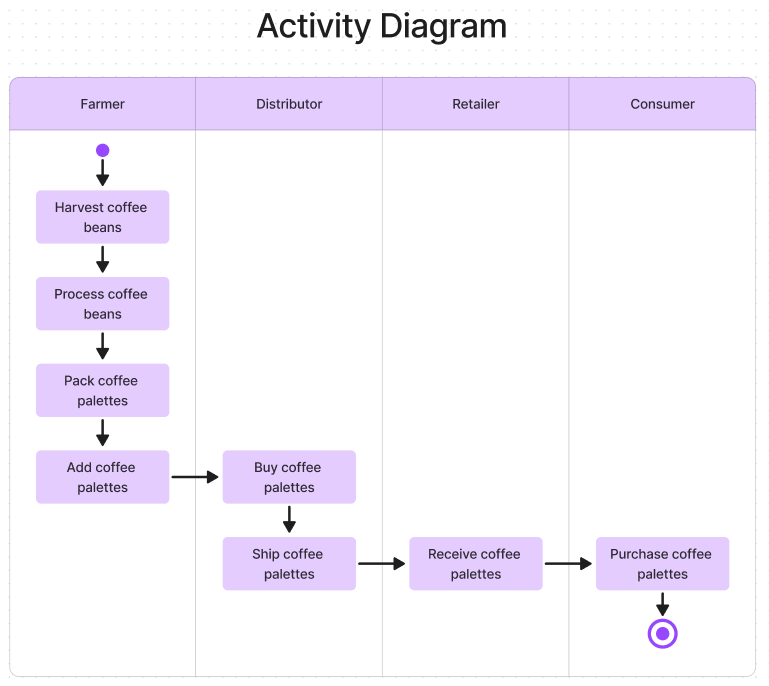
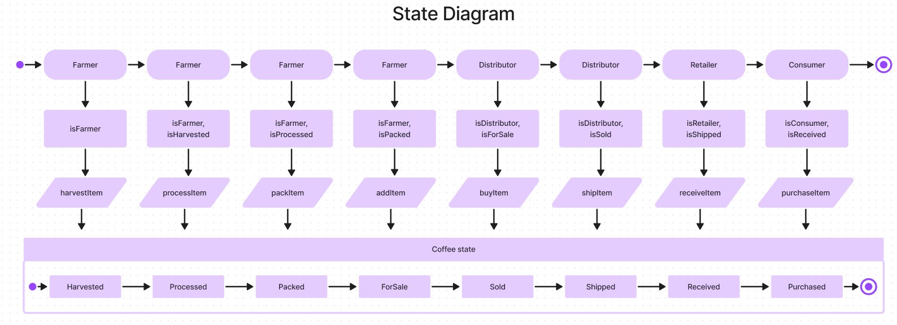

# 🔗 Ethereum Dapp for Tracking Items through Supply Chain

This project aims to create a supply chain for coffee beans creating smart contracts with solidity, making tests with Mocha and Chai, and finally, developping an Ethereum Dapp with Web3js.

## UML diagrams

### Activity Diagram

### Sequence Diagram

### State Diagram

### Class Diagram

## Libraries and Tools
- Node: 20.11.0
- Truffle: v5.11.5 
- Web3js: v1.10.0
- Solidity: v0.5.16 (but using compiler version 0.8.7)